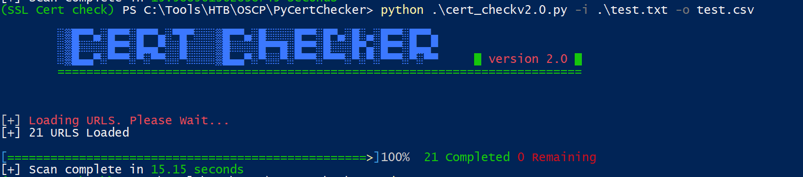

# PyCertChecker
A threaded python tool for mass checking certificate issues. This tools can identify the following certificate issues.

* Expired
* Expiring Soon
* Revocation Status (Using OCSP)
* Self Signed


## Dependencies
The script utilizes a feature that is not yet available for `ssl` library. This feature is required for getting the certificate chain from a server. Current `ssl` library has only the method to get the leaf certificate from a server ([getpeercert](https://docs.python.org/3.1/library/ssl.html#ssl.SSLSocket.getpeercert)). 

I could only find one library that can be used to create and decode OCSP requests. This library is [cryptography](https://cryptography.io/en/latest/x509/ocsp.html) and it requires the leaf and the issuer certificate to create the OCSP request, which cannot be accomplished using `ssl` library (I did try other libraries such as `pyopenssl`, but they had multiple bugs due to which I had to abandon those solutions). 

There is a patch available for `ssl` that adds the feature to fetch the certificate chain from the server. The patch can be found [here](https://bugs.python.org/issue18233). A pull request with the changes is available [here](https://github.com/python/cpython/pull/17938). Unfortunately, this patch cannot be used in python version <3.9 due to some changes in the Cpython code. With the help of a friend from discord, I was able to make the changes required to make it work in python <3.9.

The file that are used for the patch can be found in the patch folder. I replaced this files in the cpython 3.8 source code in the location mentioned in the `locations.txt` file. After that the Cpython was compiled and the resulting `ssl` shared libraries was used to get the new features. I have included the shared library for windows 32bit and linux 64bit. If you need to use it for another version, you must compile the Cpython yourself. 


### Compiling Cpython for SSL shared libraries
Using shared libraries form untrusted source can have serious consequences. If you are paranoid about security, then you can compile the Cpython on your own to get the shared libraries by following the steps below.

1. Clone the python 3.8 branch.
2. Replace the files in patch folder in the locations mentioned in the `patch/locations.txt` file.
3. Compile the `cpython` code.
4. Copy the compiled shared library to the folder containing the cert checker script.
5. In windows you will also require `libcrypto-1_1.dll` and `libssl-1_1.dll` files.

## Setup
*	Requires python3
*   Python version must be < 3.9
*	Install dependencies mentioned in `requirements.txt.`

    ```
    >pip install -r .\requirements.txt
    ```
*   Run the script using
```
>python .\cert_checkv2.0.py -i INPUTFILE -o OUTPUTFILE -t THREADS
```



## Features
*  Threaded
*  OCSP certificate status checking

## Help

```
usage: cert_checkv2.0.py [-h] -i INPUT -o OUTPUT [-t THREADS]

required arguments:
  -i INPUT, --input INPUT
                        The input file with list of URLs
  -o OUTPUT, --output OUTPUT
                        Output csv file

optional arguments:
  -h, --help            show this help message and exit
  -t THREADS, --threads THREADS
                        Set the number of threads
```
## Notes

*   The script debug log is written to `cert_check.txt`. This can be used for debugging.
*   The `log.py` is used to setup some custom logging options and also contains a method to display the completion status. 
*   Special thanks to `_Chris` from discord for helping me out solve the shared library issue. 